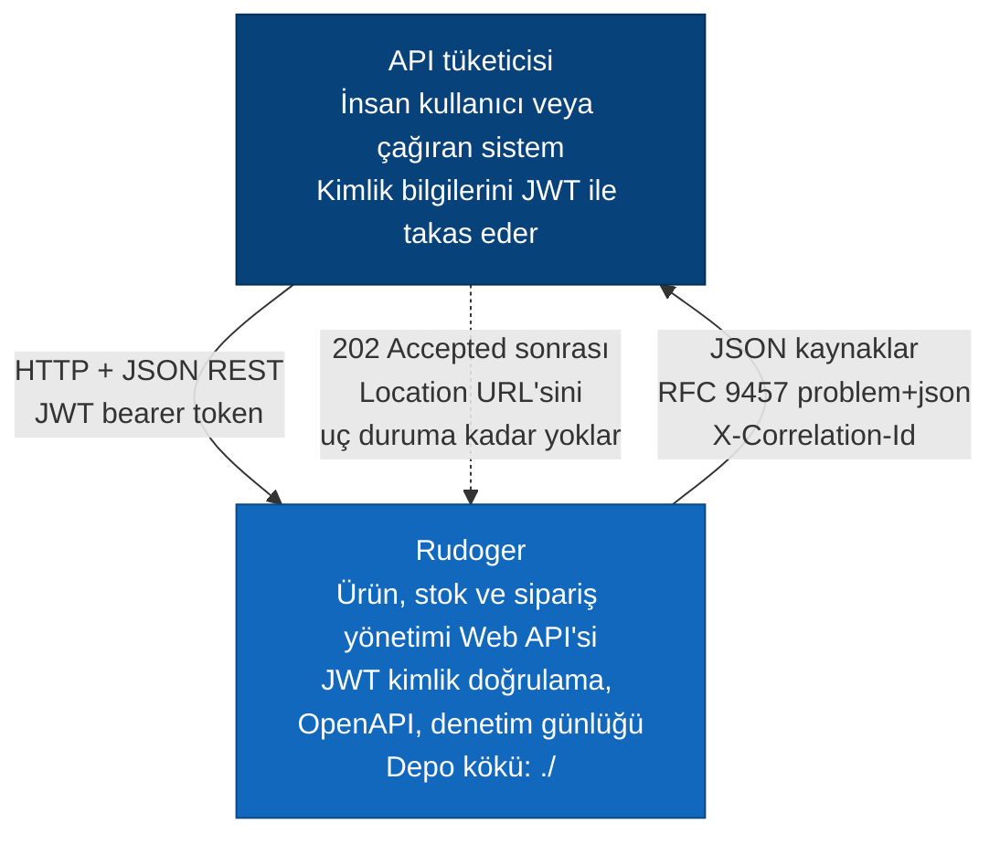
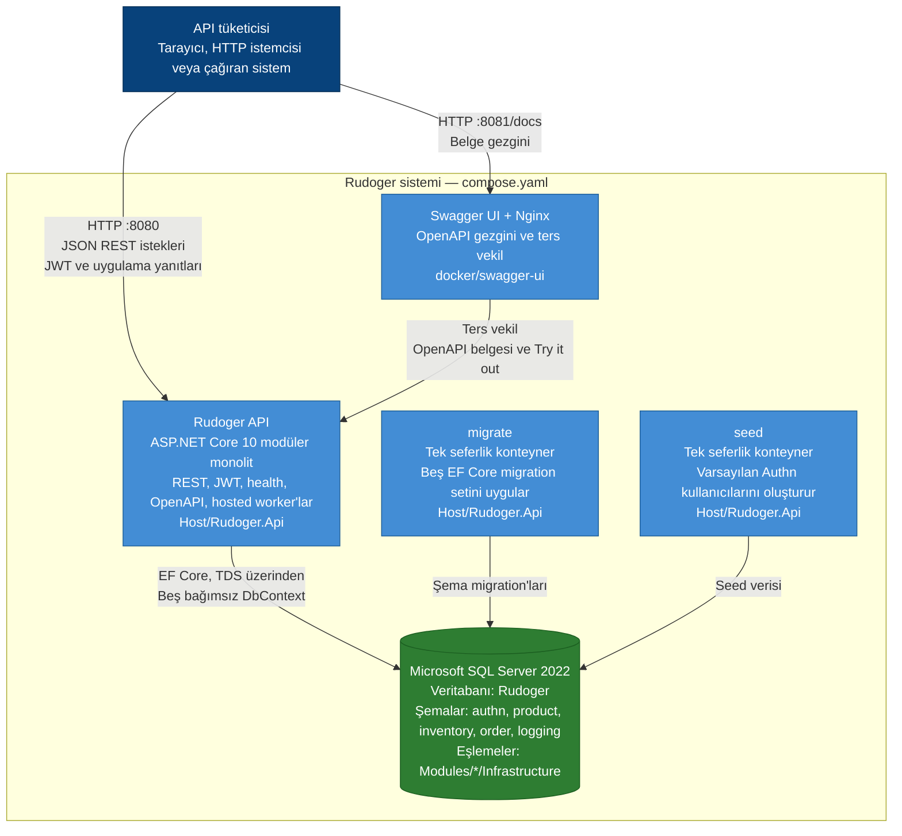
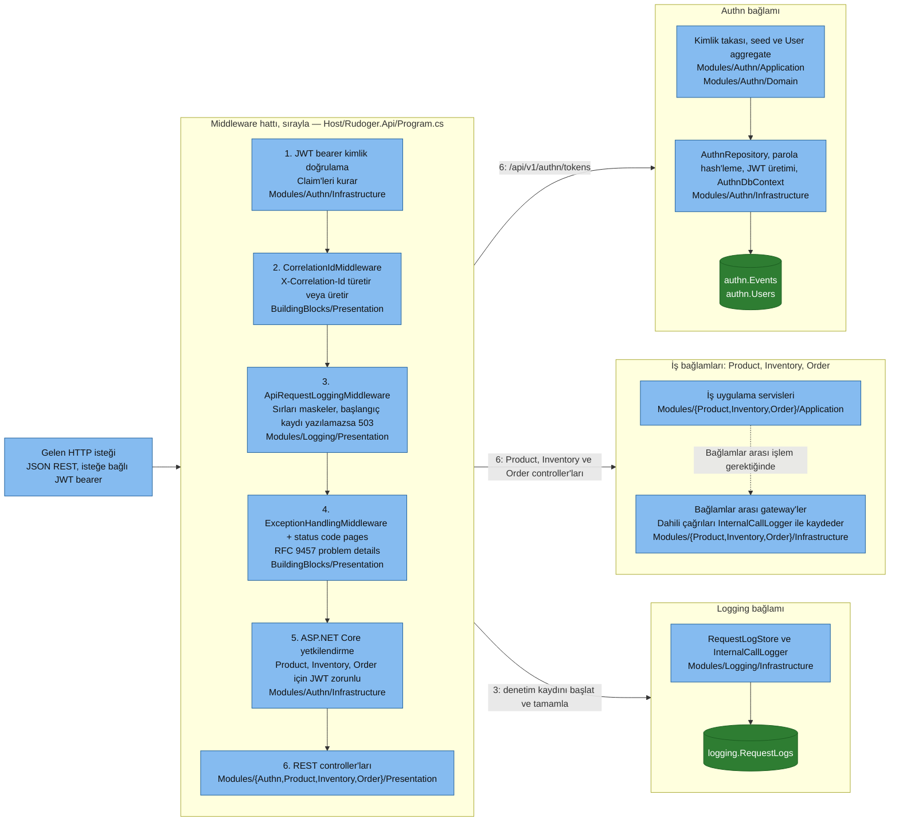
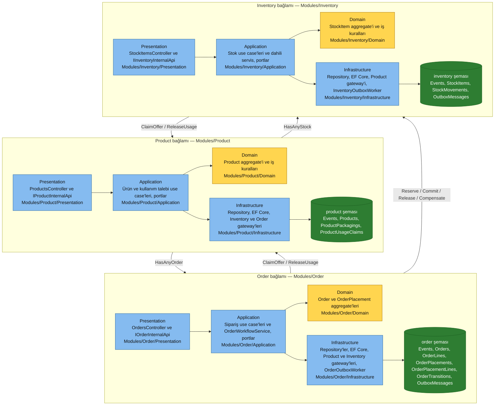
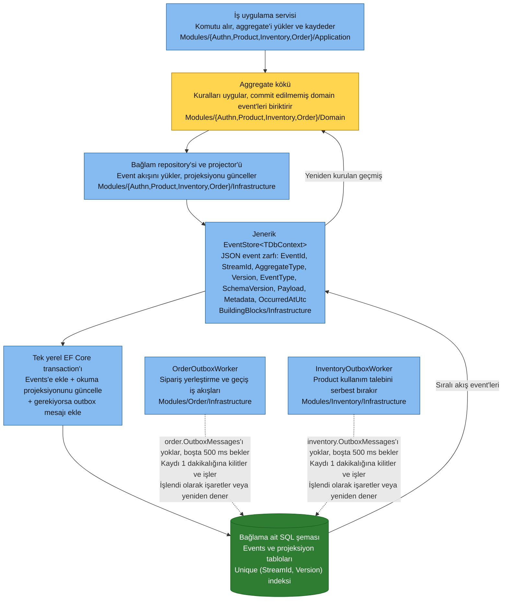
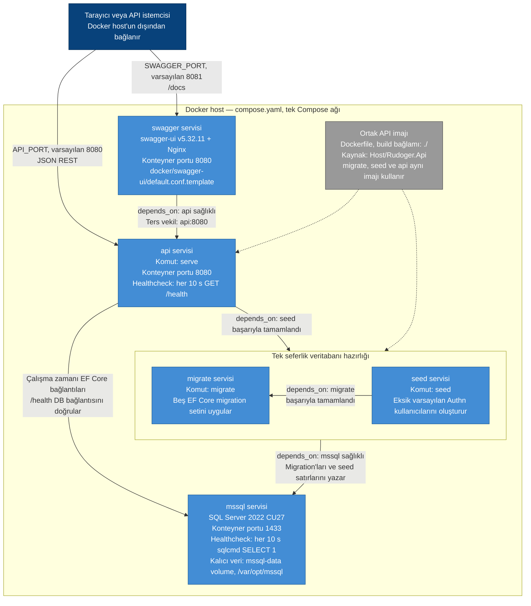
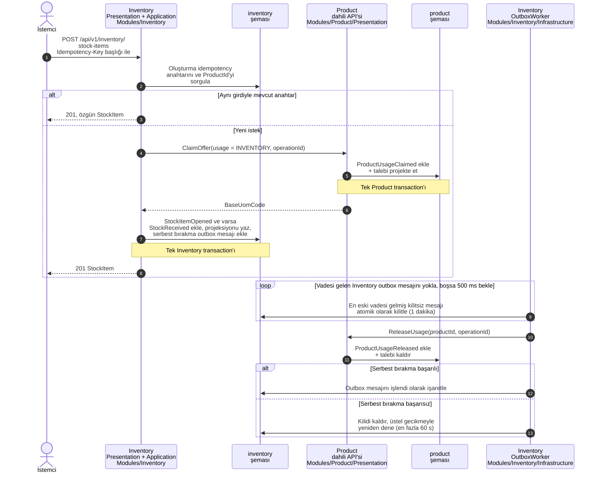
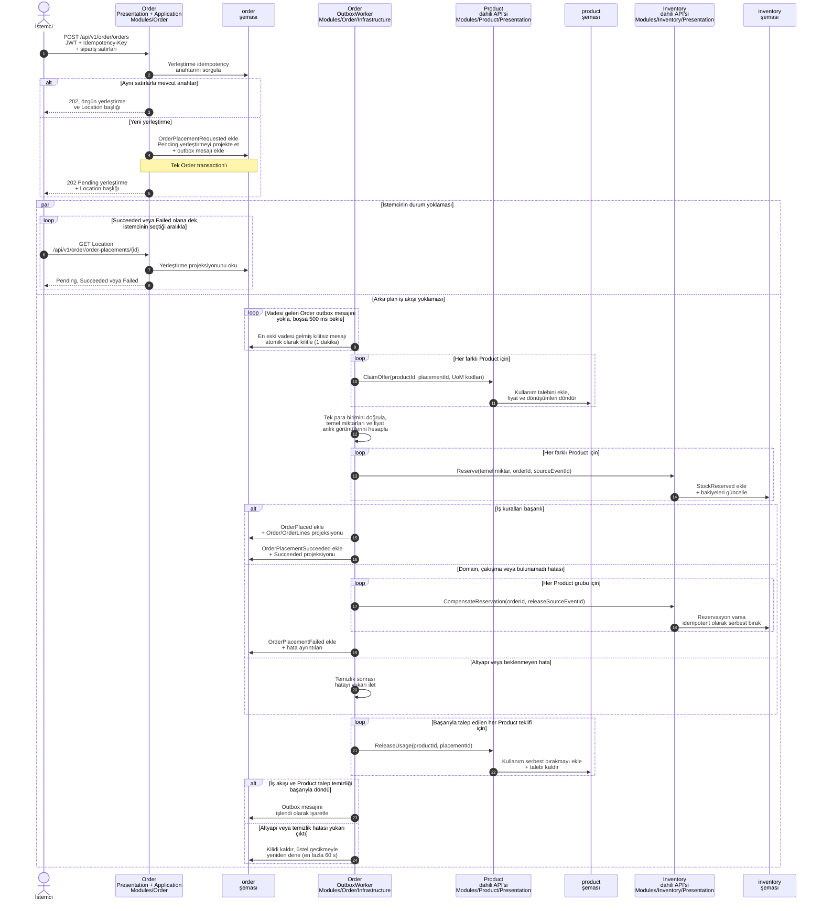
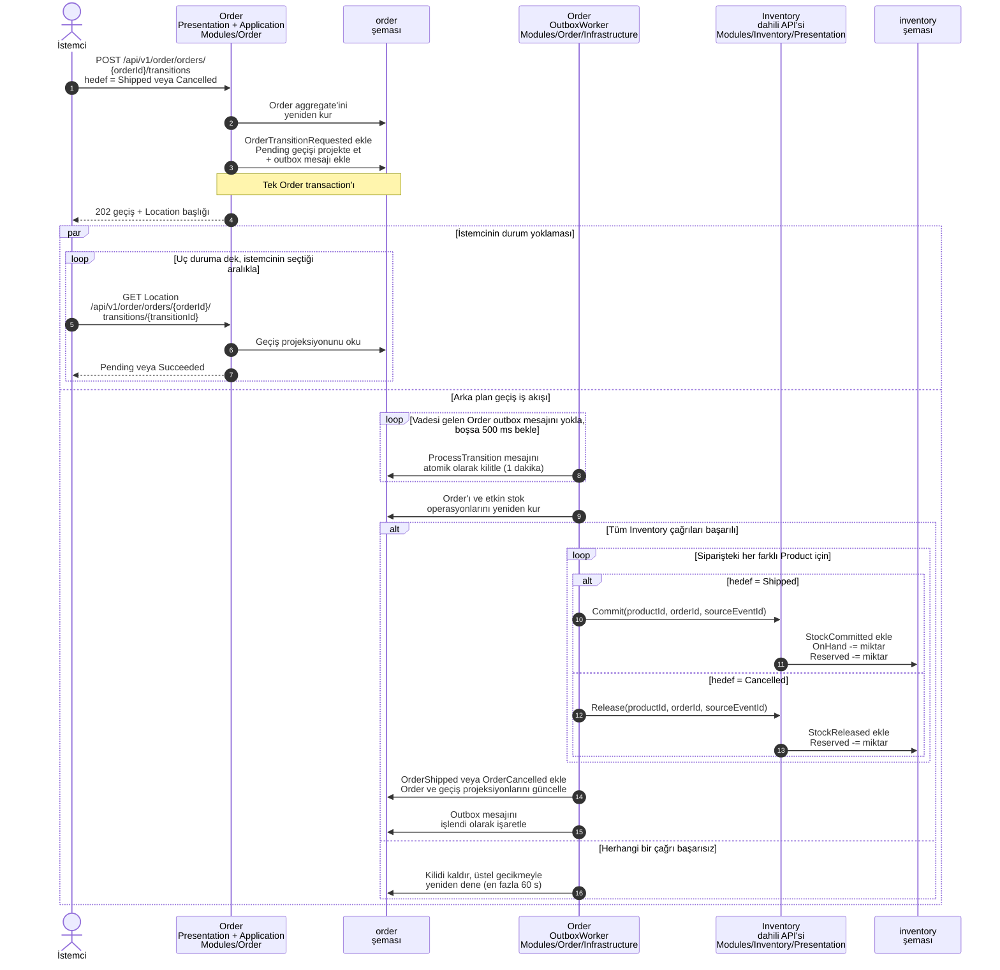
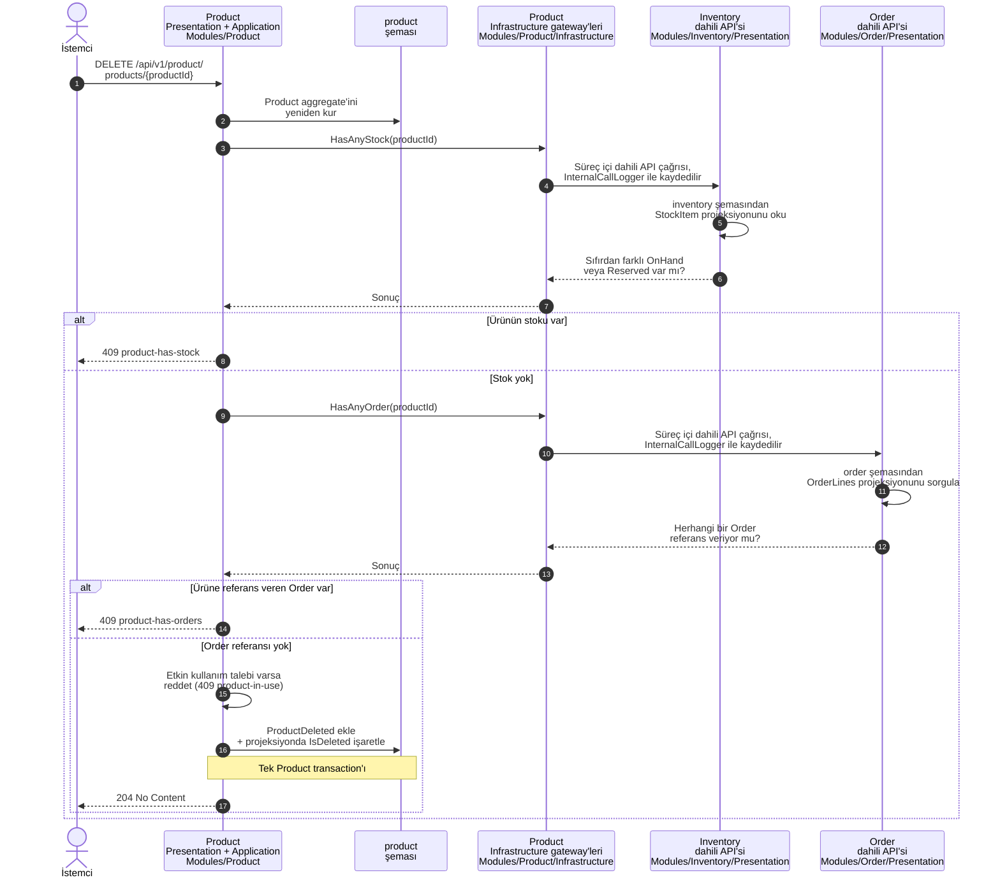

# Rudoger Mimarisi

Bu belge, depoda gözlemlenebilen mimariyi anlatır. Diyagramlar, ayrı bir C4 kütüphanesine bağımlı olmadan render edilebilsin diye C4 anlam yükü taşıyan Mermaid flowchart ve sequence diyagramları olarak çizilmiştir. Bir kutunun içinde gösterilen dizin, o kutuyu gerçekleyen depo konumudur.

## Kapsam ve gösterim

- Düz oklar eşzamanlı çalışma zamanı çağrılarını veya veri akışlarını gösterir.
- Kesikli oklar yoklama (polling), gerçekleştirim (implementation) veya yaşam döngüsü ilişkilerini gösterir.
- Deployment diyagramındaki düz oklar Compose `depends_on` koşullarını ve çalışma zamanı bağlantılarını birlikte gösterir; ayrım ok etiketlerinde belirtilmiştir.
- "Dahili API", tüketici bounded context'in Infrastructure projesinden sağlayıcı bounded context'in Presentation sözleşmesine yapılan süreç içi çağrıdır. HTTP kullanmaz.
- Authn, Product, Inventory ve Order event sourced'dur. Okuma projeksiyonları, event ekleme ile aynı yerel transaction içinde güncellenir.
- Logging, event sourced bir bounded context değil, ekle/güncelle tarzı bir operasyonel günlüktür.
- Diyagramlardaki tanımlayıcılar (sınıf, event, tablo ve uç nokta adları) kodla birebir eşleşsin diye İngilizce bırakılmıştır.

## 1. Sistem Bağlamı

**Sorumluluklar.** Rudoger, depodaki tek iş sistemidir. Kullanıcıları doğrular, ürünleri ve paketlemeleri yönetir, tek depolu stoku yönetir, sipariş yerleştirme ve durum geçişlerini koordine eder ve her HTTP ile dahili API çağrısını kayıt altına alır.

**Veri akışı.** Tüketici, kimlik bilgilerini bir JWT ile takas eder, ardından kimlik doğrulamalı REST istekleri gönderir. API ya eşzamanlı kaynak sonuçları ya da eşzamansız sipariş iş akışları için `Location` URL'si taşıyan `202 Accepted` döndürür. Tüketici, süreç `Succeeded` veya `Failed` olana kadar bu URL'yi yoklar.

**Varsayım.** "API tüketicisi" bilinçli olarak genel tutulmuştur. Depoda birinci taraf bir iş arayüzü yoktur ve çağıranın insan tarafından kullanılan bir istemci mi yoksa başka bir sistem mi olduğu belirlenmemiştir. Swagger UI bir belgeleme/test konteyneridir, iş ön yüzü değildir.

## 2. Konteyner

**Sorumluluklar.** API, beş bounded context'in tamamını içeren tek bir dağıtılabilir süreçtir. `migrate` ve `seed`, aynı imajdan üretilen ve API başlamadan önce sırayla çalışıp biten tek seferlik konteynerlerdir. Swagger UI belge kabuğunu sunar ve API trafiğini kendi origin'inden vekiller. SQL Server, bounded context başına bir şema ve migration geçmişi barındıran tek veritabanına sahiptir.

**Veri akışı.** Tüketiciler API'yi doğrudan veya Swagger'ın Nginx vekili üzerinden çağırabilir. API, aynı veritabanına karşı ayrı EF Core DbContext'leri kullanır. Kod tabanında broker, önbellek, harici kimlik sağlayıcı, ödeme servisi veya ayrı bir depo servisi yoktur.

## 3. Arka Uç Bileşenleri

### 3.1 HTTP girişi ve kesişen bileşenler

Ok etiketlerindeki numaralar, çağrıyı başlatan middleware adımını gösterir.

**Sorumluluklar.** `Program.cs`; kimlik doğrulama, korelasyon, zorunlu istek günlüğü, standart hata yanıtları, yetkilendirme, controller'lar, health ve OpenAPI'yi bu sırayla bir araya getirir. Token takası, health ve OpenAPI uç noktaları anonimdir; Product, Inventory ve Order controller'ları JWT yetkilendirmesi ister.

**Veri akışı.** Kimlik doğrulama claim'leri kurar; korelasyon `X-Correlation-Id` değerini türetir veya üretir; günlükleme, uç nokta çalışmadan önce maskelenmiş bir başlangıç kaydı yazar ve sonrasında kaydı tamamlar. Bilinen domain, çakışma, eşzamanlılık, bulunamadı, doğrulama ve kimlik doğrulama hataları `application/problem+json` yanıtlarına dönüşür. Dahili API gateway'leri aynı korelasyon bağlamını kullanır ve `InternalCallLogger` üzerinden `logging.RequestLogs` tablosuna `Internal` kanalıyla yazar.

### 3.2 İş bounded context'leri ve dahili API'ler

Bağlamlar arası oklar, çağıran bağlamın Infrastructure gateway'inden çıkıp hedef bağlamın Presentation sözleşmesine (`I*InternalApi`) ulaşır; okunabilirlik için bağlam sınırından bağlam sınırına çizilmiştir.

**Sorumluluklar.** Product; katalog, paketleme, fiyat ve geçici kullanım taleplerinin sahibidir. Inventory; temel UoM cinsinden stok bakiyelerinin ve hareketlerinin sahibidir. Order; eşzamansız yerleştirme, fiyat anlık görüntüleri, rezervasyon koordinasyonu ve shipped/cancelled geçişlerinin sahibidir. Her bağlam, Clean Architecture katmanlarını ayrı projelerde korur.

**Veri akışı.** Bağlamlar arası çağrılar yalnızca tüketicinin Infrastructure gateway'inden çıkar ve sağlayıcının Presentation sözleşmesini hedefler. Süreç içi çağrılardır, ancak her bounded context bağımsız commit eder. Ürün silme, Inventory ve Order'a sorar. Inventory, stok açarken veya elle hareket girerken Product'ı talep eder. Order, Product tekliflerini talep eder ve Inventory'ye rezervasyon, commit, release veya telafi komutları verir. Her gateway çağrısı, 3.1'de gösterilen `InternalCallLogger` üzerinden `logging.RequestLogs` tablosuna yazılır.

### 3.3 Event store, projeksiyonlar, outbox'lar ve worker yoklaması

**Sorumluluklar.** Jenerik event store, kararlı event zarflarını serileştirir ve yarışları unique `(StreamId, Version)` kısıtı ile çözer. Repository projector'leri okuma modellerini aynı transaction içinde günceller. Order ve Inventory, yerel transaction'larına outbox satırları ekler ve bunları en az bir kez işler.

**Veri akışı ve yoklama.** Repository'ler aggregate'i yeniden kurmak için sıralı event'leri yükler; yeni event'leri ve projeksiyonları atomik olarak kaydeder. Her hosted worker, vadesi gelmiş ve kilitsiz tek bir satırı tekrar tekrar kilitleyerek alır. Uygun satır yoksa yeniden yoklamadan önce **500 ms** bekler. Kilit bir dakika sürer; hatalar 60 saniyede sınırlanan üstel yeniden deneme gecikmeleri kullanır. Kaynak event ID'leri ve idempotency anahtarları, tekrarlanan Inventory etkilerini güvenli kılar.

## 4. Deployment

**Sorumluluklar.** Compose; SQL Server'ı, iki tek seferlik veritabanı yaşam döngüsü komutunu, uzun ömürlü API'yi ve Swagger UI'ı çalıştırır. `migrate`, `seed` ve `api` aynı Dockerfile'dan üretilir ve davranışı çalıştırılabilir dosyanın komutuyla seçer. Adlandırılmış volume SQL Server verisini kalıcı kılar.

**Veri akışı ve yoklama.** Başlangıç sırasıyla SQL sağlığı, başarılı migration, başarılı seed ve API sağlığı ile kapılanır; diyagramdaki `depends_on` okları bağımlı servisten beklediği servise doğru okunur. SQL ve API healthcheck'leri her **10 saniyede** bir yoklar. `/health`, SQL bağlantısını `AuthnDbContext` üzerinden doğrular. Swagger, Compose ağında `api:8080` adresine vekillik eder.

**Varsayım.** Depo tarafından tanımlanan tek deployment topolojisi budur. Tek bir Compose host'unu temsil eder; üretim yük dengeleyicisi, TLS sonlandırma, gizli anahtar deposu, replika veya yüksek erişilebilirlik topolojisi çıkarsanmamıştır.

## 5. Kritik Operasyon Sequence Diyagramları

### 5.1 Stok kalemi açma ve geçici Product talebini serbest bırakma

**Sorumluluklar.** Inventory, kanonik temel UoM'yi alıp kendi stok durumunu commit ederken silinmeyi önlemek için Product'ı geçici olarak talep eder. Yerel Inventory transaction'ı, bu talebi serbest bırakmak için gereken outbox işini de oluşturur.

**Veri akışı ve yoklama.** `Idempotency-Key`, stok oluşturmayı tekrarlanabilir kılar. Inventory worker'ı outbox'ını 500 ms boşta bekleme ile yoklar, Product dahili API'sini süreç içinde çağırır ve mesajı işaretler veya yeniden zamanlar. Elle giriş, düzeltme ve düşüm hareketleri de aynı Product talebi serbest bırakma desenini kullanır.

### 5.2 Siparişi eşzamansız yerleştirme

**Sorumluluklar.** İlk istek bir Order değil, kalıcı bir yerleştirme süreci oluşturur. Worker; Product fiyatlarının ve dönüşüm çarpanlarının anlık görüntüsünü alır, temel UoM cinsinden stok rezerve eder, Order'ı yalnızca rezervasyonlar başarılı olduktan sonra oluşturur ve iş hatasında rezervasyonları telafi eder.

**Veri akışı ve yoklama.** API hemen `202` döndürür. İstemci `Location` kaynağını kendi seçtiği aralıkla yoklar; kodda üretim istemcisi için bir aralık öngörülmemiştir. Bundan bağımsız olarak `OrderOutboxWorker` boştayken her 500 ms'de bir yoklar. Gateway çağrıları süreç içidir ve dahili çağrı olarak kayıt altına alınır. Her bounded context ayrı commit ettiği için idempotent kaynak event ID'leri ve telafi, yeniden denemeleri korur.

### 5.3 Siparişi eşzamansız olarak sevk etme veya iptal etme

**Sorumluluklar.** Geçiş kararının sahibi Order, stok etkisinin sahibi Inventory'dir. Sevkiyat rezervasyonu hem eldeki hem de rezerve bakiyeden düşer; iptal yalnızca rezerve bakiyeyi serbest bırakır.

**Veri akışı ve yoklama.** Geçiş isteği ve outbox satırı birlikte commit edilir. İstemci döndürülen geçiş URL'sini yoklarken aynı Order worker yoklama döngüsü isteği işler. Hatalar worker'ın yeniden deneme politikasına düşer; Inventory kaynak event ID'leri tekrarlanan commit/release komutlarını idempotent kılar.

### 5.4 Product'ı yalnızca bağlamlar arası kurallar izin verdiğinde silme

**Sorumluluklar.** Product kendi etkin kullanım talebi kuralını uygular ve stok ile Order referanslarını sahibi olan bounded context'lere sorar. Şemalar arası foreign key veya bağlamlar arası doğrudan tablo erişimi kullanılmaz.

**Veri akışı.** Product Infrastructure gateway'leri, Inventory ve Order Presentation sözleşmelerini süreç içinde çağırır ve bu çağrıları kayıt altına alır. Başarılı silme, tek Product transaction'ında bir event ile yumuşak silme projeksiyon güncellemesidir; herhangi bir stok, Order referansı veya etkin operasyon çakışma üretir.

## Varsayımlar ve bilinçli eksiklikler

1. Deployment diyagramı yalnızca depoya işlenmiş Compose topolojisini modeller. Depo, bulut veya çok düğümlü bir üretim topolojisi tanımlamaz.
2. İstemci yoklaması, açık `202 + Location` sözleşmesinin parçasıdır; ancak aralığı ve zaman aşımı API tarafından yapılandırılmaz. Uçtan uca testin 200 ms aralığı test davranışıdır ve üretim gereksinimi olarak sunulmaz.
3. Worker yoklama aralıkları, kilit süresi, yeniden deneme üst sınırı ve Compose healthcheck aralıkları varsayım değildir; `OrderOutboxWorker`, `InventoryOutboxWorker` ve `compose.yaml` içinde açıkça yer alır.
4. Mesaj broker'ı, önbellek, harici kimlik doğrulama sağlayıcısı, ödeme işlemcisi, depo servisi, refresh token servisi veya ön yüz uygulaması bulunmadığı için hiçbiri gösterilmemiştir.

## Birincil uygulama kanıtları

- Kompozisyon ve middleware sırası: `Host/Rudoger.Api/Program.cs`
- Konteyner topolojisi ve sağlık yoklaması: `compose.yaml`, `Dockerfile`, `docker/swagger-ui/default.conf.template`
- Katman ve bounded context bağımlılık kuralları: `Tests/Architecture/ModuleDependencyTests.cs` ve tüm proje referansları
- Event transaction'ları ve eşzamanlılık: `BuildingBlocks/Infrastructure/EventStore.cs`
- Dahili API gateway'leri: `Modules/{Product,Inventory,Order}/Infrastructure/*Gateway.cs`
- Eşzamansız iş akışları ve yoklama: `Modules/Order/Infrastructure/OrderOutboxWorker.cs`, `Modules/Inventory/Infrastructure/InventoryOutboxWorker.cs`
- Sipariş orkestrasyonu: `Modules/Order/Application/OrderWorkflowService.cs`
- Veritabanı sahipliği: `Modules/*/Infrastructure` altındaki beş `*DbContext.cs` dosyası
